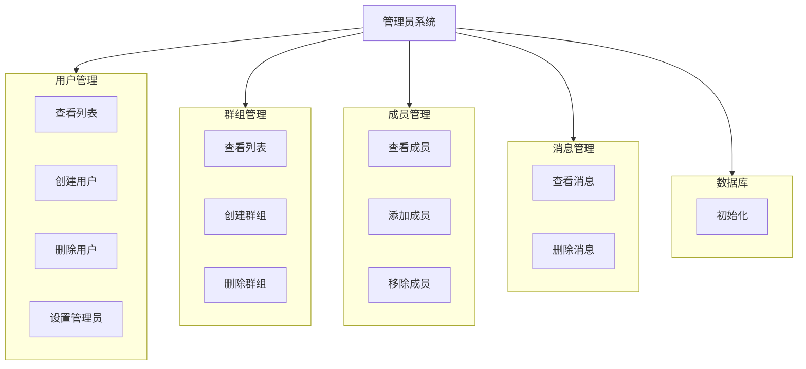

```mermaid
graph TD
    A[管理员系统]

    subgraph A1[用户管理]
        direction LR
        U1[查看列表]
        U2[创建用户]
        U3[删除用户]
        U4[设置管理员]
    end

    subgraph A2[群组管理]
        direction LR
        G1[查看列表]
        G2[创建群组]
        G3[删除群组]
    end

    subgraph A3[成员管理]
        direction LR
        M1[查看成员]
        M2[添加成员]
        M3[移除成员]
    end

    subgraph A4[消息管理]
        direction LR
        C1[查看消息]
        C2[删除消息]
    end

    subgraph A5[数据库]
        D1[初始化]
    end

    A --> A1
    A --> A2
    A --> A3
    A --> A4
    A --> A5
```