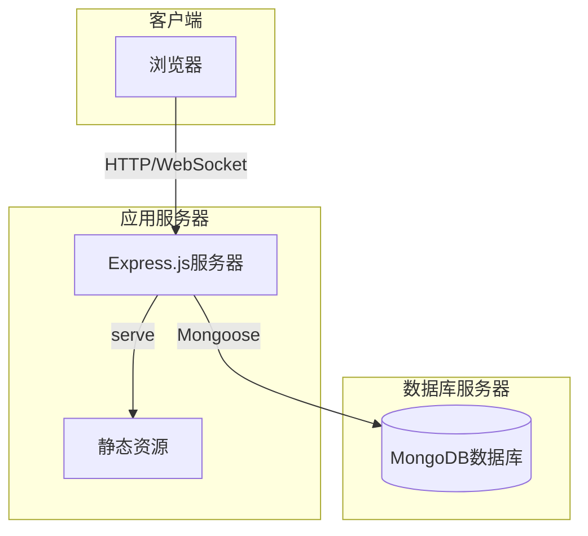
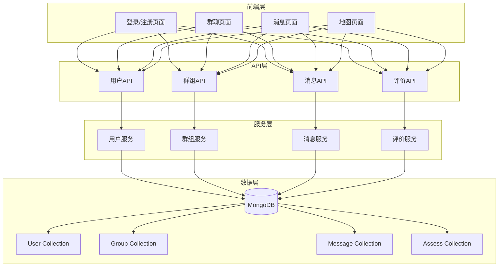
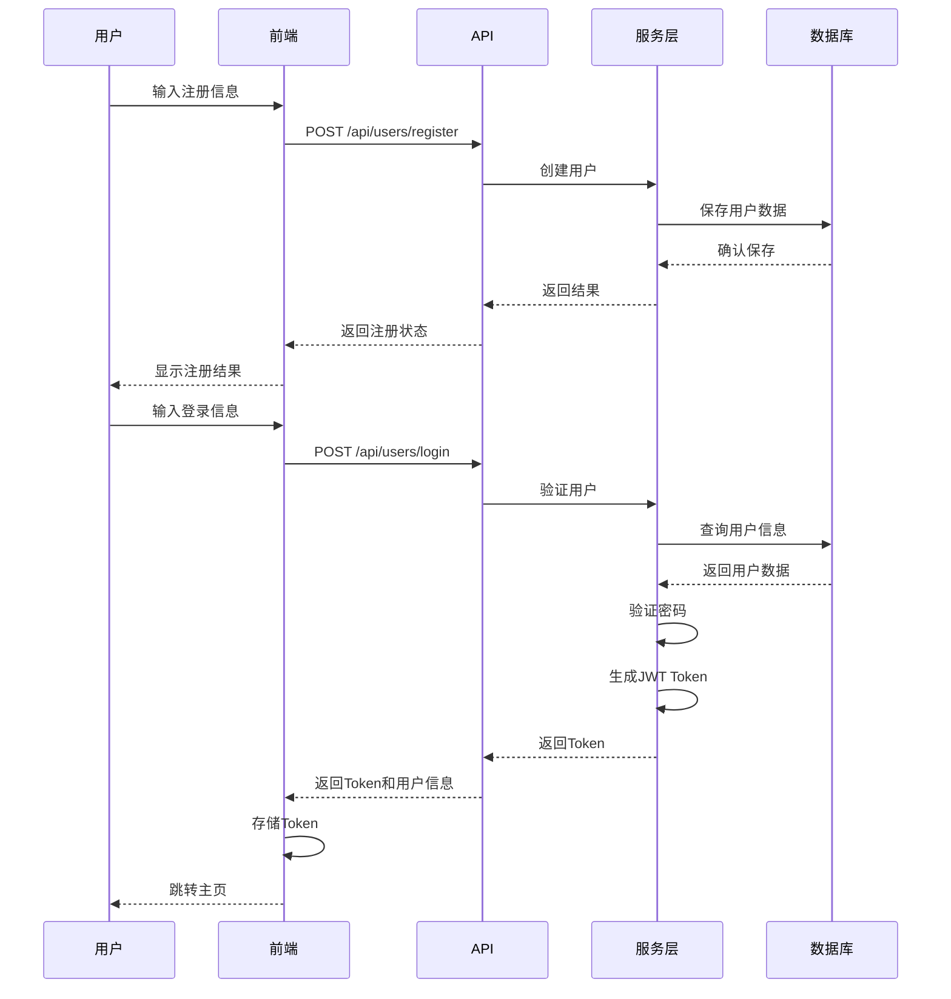
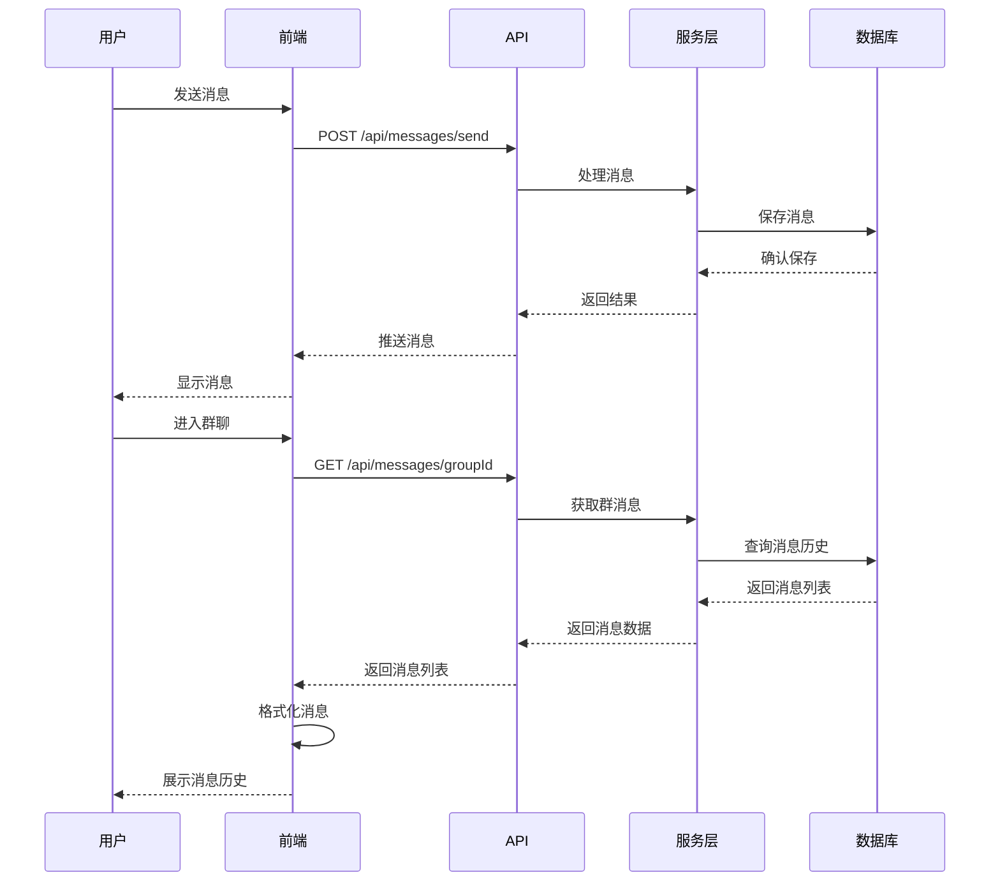
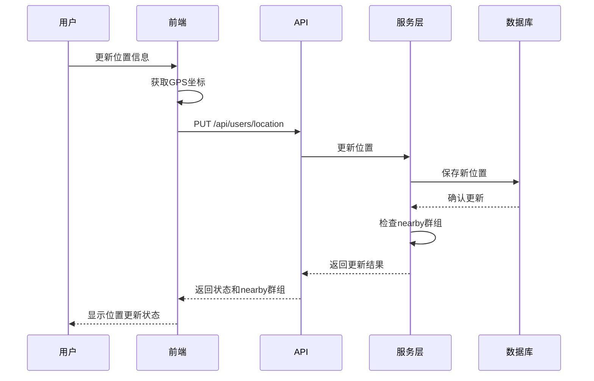
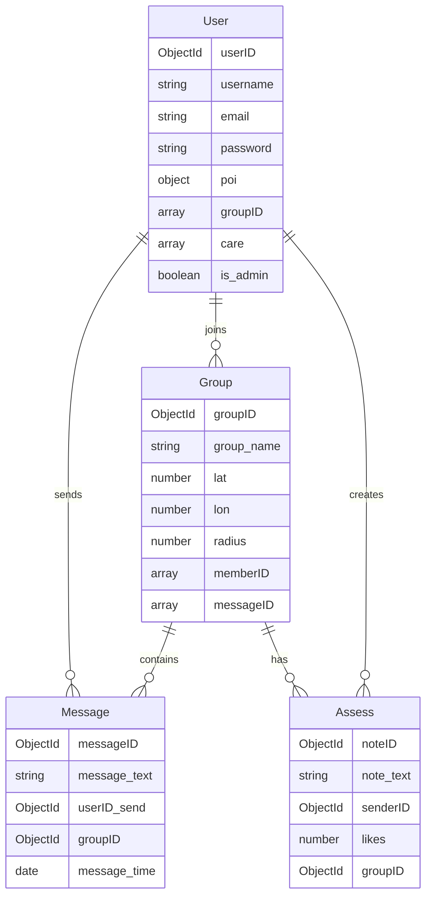
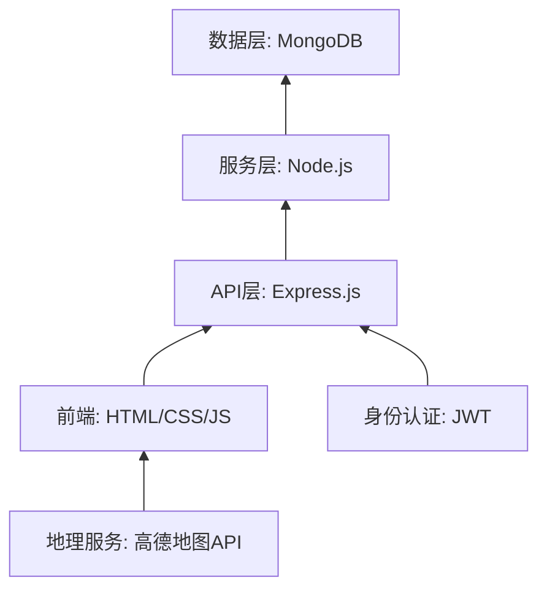
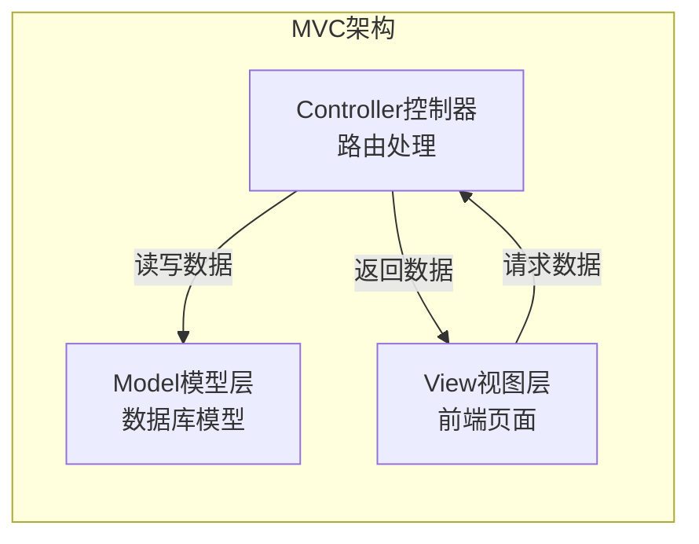

```mermaid
graph TB
    subgraph 客户端
        Browser[浏览器]
    end
    
    subgraph 应用服务器
        Express[Express.js服务器]
        Static[静态资源]
    end
    
    subgraph 数据库服务器
        MongoDB[(MongoDB数据库)]
    end

    Browser -->|HTTP/WebSocket| Express
    Express -->|Mongoose| MongoDB
    Express -->|serve| Static
```

```mermaid
graph TB
    subgraph 前端层
        A[登录/注册页面]
        B[群聊页面]
        C[消息页面]
        D[地图页面]
    end
    
    subgraph API层
        E[用户API]
        F[群组API]
        G[消息API]
        H[评价API]
    end
    
    subgraph 服务层
        I[用户服务]
        J[群组服务]
        K[消息服务]
        L[评价服务]
    end
    
    subgraph 数据层
        M[(MongoDB)]
        N[User Collection]
        O[Group Collection]
        P[Message Collection]
        Q[Assess Collection]
    end

    A & B & C & D --> E & F & G & H
    E --> I
    F --> J
    G --> K
    H --> L
    I & J & K & L --> M
    M --> N & O & P & Q
```

```mermaid
sequenceDiagram
    participant 用户
    participant 前端
    participant API
    participant 服务层
    participant 数据库

    %% 注册流程
    用户->>前端: 输入注册信息
    前端->>API: POST /api/users/register
    API->>服务层: 创建用户
    服务层->>数据库: 保存用户数据
    数据库-->>服务层: 确认保存
    服务层-->>API: 返回结果
    API-->>前端: 返回注册状态
    前端-->>用户: 显示注册结果

    %% 登录流程
    用户->>前端: 输入登录信息
    前端->>API: POST /api/users/login
    API->>服务层: 验证用户
    服务层->>数据库: 查询用户信息
    数据库-->>服务层: 返回用户数据
    服务层->>服务层: 验证密码
    服务层->>服务层: 生成JWT Token
    服务层-->>API: 返回Token
    API-->>前端: 返回Token和用户信息
    前端->>前端: 存储Token
    前端-->>用户: 跳转主页

```

```mermaid
sequenceDiagram
    participant 用户
    participant 前端
    participant API
    participant 服务层
    participant 数据库

    %% 群聊消息发送流程
    用户->>前端: 发送消息
    前端->>API: POST /api/messages/send
    API->>服务层: 处理消息
    服务层->>数据库: 保存消息
    数据库-->>服务层: 确认保存
    服务层-->>API: 返回结果
    API-->>前端: 推送消息
    前端-->>用户: 显示消息

    %% 群聊消息展示流程
    用户->>前端: 进入群聊
    前端->>API: GET /api/messages/groupId
    API->>服务层: 获取群消息
    服务层->>数据库: 查询消息历史
    数据库-->>服务层: 返回消息列表
    服务层-->>API: 返回消息数据
    API-->>前端: 返回消息列表
    前端->>前端: 格式化消息
    前端-->>用户: 展示消息历史

```

```mermaid
sequenceDiagram
    participant 用户
    participant 前端
    participant API
    participant 服务层
    participant 数据库

    %% 修改地理位置流程
    用户->>前端: 更新位置信息
    前端->>前端: 获取GPS坐标
    前端->>API: PUT /api/users/location
    API->>服务层: 更新位置
    服务层->>数据库: 保存新位置
    数据库-->>服务层: 确认更新
    服务层->>服务层: 检查nearby群组
    服务层-->>API: 返回更新结果
    API-->>前端: 返回状态和nearby群组
    前端-->>用户: 显示位置更新状态
```

```mermaid
erDiagram
    User ||--o{ Message : sends
    User ||--o{ Group : joins
    Group ||--o{ Message : contains
    Group ||--o{ Assess : has
    User ||--o{ Assess : creates
    
    User {
        ObjectId userID
        string username
        string email
        string password
        object poi
        array groupID
        array care
        boolean is_admin
    }
    
    Group {
        ObjectId groupID
        string group_name
        number lat
        number lon
        number radius
        array memberID
        array messageID
    }
    
    Message {
        ObjectId messageID
        string message_text
        ObjectId userID_send
        ObjectId groupID
        date message_time
    }
    
    Assess {
        ObjectId noteID
        string note_text
        ObjectId senderID
        number likes
        ObjectId groupID
    }
```

```mermaid
graph BT
    A[前端: HTML/CSS/JS] --> B[API层: Express.js]
    B --> C[服务层: Node.js]
    C --> D[数据层: MongoDB]
    E[身份认证: JWT] --> B
    F[地理服务: 高德地图API] --> A
```

```mermaid
graph LR
    subgraph MVC架构
        M[Model模型层<br>数据库模型]
        V[View视图层<br>前端页面]
        C[Controller控制器<br>路由处理]
    end

    C -->|读写数据| M
    C -->|返回数据| V
    V -->|请求数据| C
```

```mermaid
graph LR
    subgraph 用户管理
        A[用户注册]
        B[用户登录]
        C[用户信息修改]
    end

    subgraph 群组管理
        D[群组创建]
        E[群组加入]
        F[群组退出]
    end

    subgraph 消息管理
        G[消息发送]
        H[消息接收]
    end

    subgraph 评价管理
        I[评价发送]
        J[评价查看]
    end

    A -->|POST /api/users/register| B
    B -->|POST /api/users/login| C
    C -->|PUT /api/users/update| D
    D -->|POST /api/groups/create| E
    E -->|POST /api/groups/join| F
    F -->|POST /api/groups/quit| G
    G -->|POST /api/messages/send| H
    H -->|GET /api/messages/groupId| I
    I -->|POST /api/assess/send| J
```
